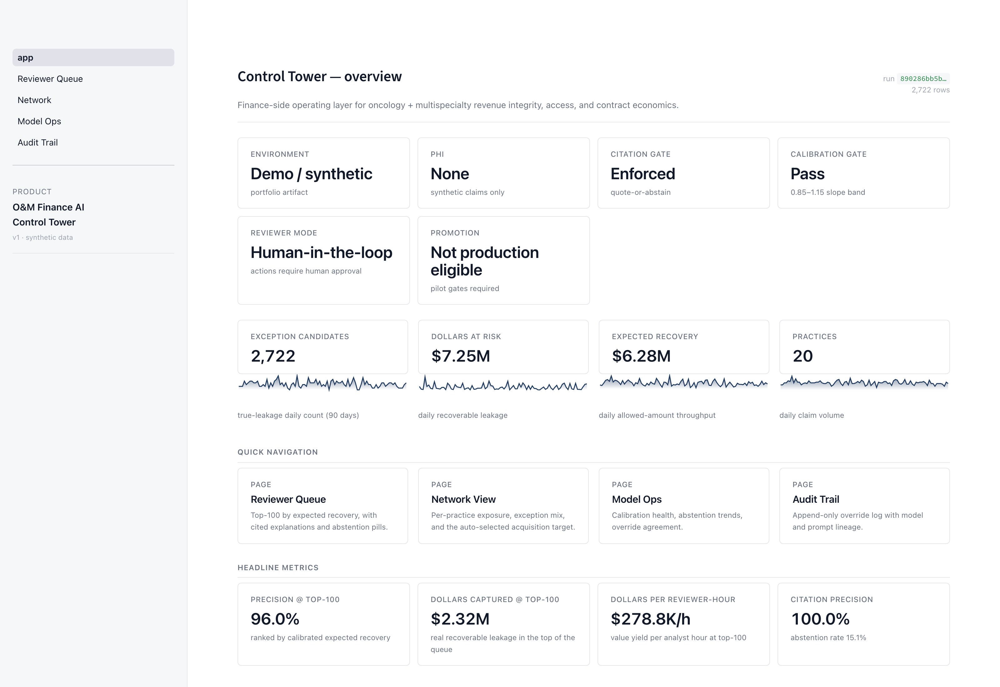

# O&M Finance AI Control Tower

**Finance AI operating layer for McKesson's Oncology & Multispecialty ecosystem — revenue integrity, access/prior-auth intelligence, specialty drug economics, and practice performance across oncology, retinal, rheumatology, gastroenterology, and neurology care.**

> The finance-side operating layer above O&M's existing practice-facing capabilities (Glide Health claims acceptance, CoverMyMeds access automation, Onmark GPO savings, Regimen Profiler / Practice Insights analytics, iKnowMed EHR, Ontada data). Focused on ROI sizing, exception prioritization, evidence-grounded explanation, controllership audit trail, and adoption metrics — so practices can reduce administrative burden, accelerate access, and keep providers focused on patients.

**Status:** V1.1 shipped (Weeks 0–4 + polish + V2 hero features). Working end-to-end pipeline: **ten** exception types across revenue-cycle + access + contract economics; multispecialty coverage across five specialties; 5-fold CV isotonic calibration; evidence-grounded RAG with honest abstention; flag-gated LLM paraphrase layer with strict citation contract; simulated override log; per-practice performance + acquisition model; governance reference architecture (with V2 retrospective-label schemas + Unity Catalog RLS pattern); **9 Databricks SQL query files (8 V1 dashboard panels + 1 V2 working-capital / DSO exposure query)** + six drift alarms + governance DDL; Streamlit reviewer-queue mock; CI runs tests + end-to-end pipeline + practice analysis on every push (lint + security advisory). See **[docs/current-results.md](docs/current-results.md)** for canonical headline numbers and **[docs/refinement-plan.md](docs/refinement-plan.md)** for what shipped vs. parked V2/V3 backlog.

**Author:** Andre Profitt · [LinkedIn](https://www.linkedin.com/in/andreprofitt) · built as a public Lead-TPM-Finance-AI portfolio artifact.

**Not affiliated with McKesson, US Oncology Network, Ontada, CoverMyMeds, Glide Health, or any other named entity. No PHI. All claims data is synthetic; drug prices anchored to public CMS ASP Part B files.**



---

## 60-second evaluator path

For a hiring manager / interview panel skimming this artifact:

1. Look at the **Control Tower overview** screenshot above — governance posture ribbon, headline KPIs, navigation surfaces.
2. Open [`docs/assets/02_reviewer_queue.png`](docs/assets/02_reviewer_queue.png) — top-N work queue, evidence, abstention, disposition with session-scoped audit-event preview.
3. Open [`docs/assets/03_model_ops.png`](docs/assets/03_model_ops.png) — release-gate summary (pass / monitor / blocked) over calibration, citation, abstention, fairness, security, promotion.
4. Open [`docs/assets/04_audit_trail.png`](docs/assets/04_audit_trail.png) — append-only override log with model + prompt + source-doc lineage.
5. Open [`docs/assets/05_network.png`](docs/assets/05_network.png) — per-practice exposure, specialty mix, auto-selected acquisition target.
6. Read [`docs/current-results.md`](docs/current-results.md) for the canonical metric run, then [`docs/charter.md`](docs/charter.md) and [`docs/value-realization-runbook.md`](docs/value-realization-runbook.md) for the TPM framing.

---

## Run it yourself

```bash
git clone https://github.com/Andre-Profitt/om-finance-ai
cd om-finance-ai
make install                          # uv sync --all-extras
make demo                             # end-to-end pipeline
uv run oai-finance practice-analysis  # per-practice + acquisition model
make mlflow-ui                        # browse model runs
make test                             # smoke test
```

The `make demo` command runs the full nine-stage pipeline locally on Parquet (Databricks-ready: Delta + Unity Catalog schemas + MLflow + Asset Bundle skeleton ship in the repo, but a production pilot would still need workspace-specific validation, access controls, and conversion testing against the target Azure Databricks environment). It produces `artifacts/eval_report.md`, calibration and capture-curve plots, an MLflow-registered LightGBM model, isotonic-calibrated scores, evidence-grounded per-exception explanations, and a simulated override log. The `practice-analysis` CLI produces a network + target-practice + 100-day integration projection feeding the executive memo at `docs/practice-performance-memo.md`.

## What the Control Tower does

Five capability modules, all built on one Databricks-native pipeline. All metrics below are produced by the running code on synthetic data with drug prices anchored to real CMS ASP.

### 1. Revenue Integrity Queue

Claims at risk of denial, underpayment, or coding mismatch — prioritized by calibrated expected recovery, cited to specific policy or contract clause, or routed to human when evidence is weak.

### 2. Access & Prior-Authorization Intelligence

Claims with PA gaps, CO-197 denials, and expected access-delay operational cost. Cites payer PA workflow documentation for every flag. Complements existing access tooling (e.g., CoverMyMeds) by scoring pre-bill risk and quantifying delay cost at the network level.

### 3. Specialty Drug Contract Economics

ASP / J-code / NDC variance, chargeback validation, biosimilar conversion, 340B scenario as a compliance-first module (not a headline). Cites GPO and payer contract clauses.

### 4. Practice Performance & Acquisition Model

Per-practice exposure, exception mix, payer mix, and a 100-day integration projection with five sequenced initiatives. Feeds the executive memo with real computed numbers, not prose estimates.

### 5. Governance & Audit Log

Append-only override log with model version, prompt version, retrieved-doc version, reviewer rationale. Full reference architecture for Databricks + Azure deployment (Unity Catalog RBAC, PHI/HIPAA overlay, SOX-aligned change control, drift alarms) in `docs/governance.md`.

## Pipeline architecture

Nine stages with a **Databricks-ready** design (Delta + Unity Catalog schema definitions, MLflow tracking, Databricks Asset Bundle skeleton, SQL dashboard logic). Runs locally on Parquet today. A production pilot would still need workspace-specific validation, access-control review, data-source onboarding, and Azure Databricks environment testing — see `docs/dua-irb-checklist.md` and `docs/discovery-plan.md` for the gating activities.

1. **Bronze — CMS ingest.** Real CMS ASP + NDC-HCPCS crosswalk (sample snapshot committed; live-fetch hook ready).
2. **Bronze — synthetic claims.** 5,000 claims across **18 HCPCS codes** spanning oncology + retinal + rheumatology + GI + neurology; 4 payer archetypes; latent error state observed noisily by rules; site-of-care + JW-modifier compliance flags.
3. **Silver — drug economics + claim lines.** ASP ratios, NDC validity, paid/allowed ratios, specialty dimensions, 340B flags, site-of-care, JW required.
4. **Gold — rule-based exception candidates.** **Ten exception types** in priority order: `access_pa_gap`, `jw_drug_waste`, `gpo_340b_rebate_excluded`, `chargeback_validity_fail`, `biosimilar_conversion_miss`, `site_of_care_underpayment`, `ndc_hcpcs_mismatch`, `asp_drift`, `underpayment`, `denial`.
5. **Gold — LightGBM risk scoring + MLflow.** Registered model with gain-based feature importance; separate `pa_propensity` model for pre-bill PA-denial risk.
6. **Gold — 5-fold CV isotonic calibration.** Out-of-fold isotonic with sample-weighted reliability slope **0.99** (target band 0.85–1.15).
7. **RAG — evidence-grounded explanation.** Dense retrieval over **10 payer policies + 6 GPO contracts**. Quote-or-abstain citation enforcement; optional flag-gated LLM paraphrase layer with strict post-generation citation verifier.
8. **Governance — override log.** Append-only, simulated top-100 reviewer decisions; Unity Catalog RLS pattern with practice-scoped row filters.
9. **Eval — business-outcome report.** Three rankings, rules-only baseline, citation precision, abstention rate, per-type + per-specialty precision, equal-effort fairness slice.

## Headline results (5,000 synthetic claims, seed 20260424)

> **Single source of truth: [`docs/current-results.md`](docs/current-results.md).** If a number in this README and one in another doc disagree, the canonical file wins. Run `make demo` to regenerate.

**Reviewer-queue rankings on 2,722 exception candidates across 10 types:**

| Metric                                 | Calibrated expected-recovery ranking |
| -------------------------------------- | ------------------------------------ |
| Precision @ top-100                    | **96.0%**                            |
| Dollars captured @ top-100             | **$2,323,674**                       |
| Citation precision                     | **100.0%**                           |
| Abstention rate                        | **15.1%**                            |
| Calibration slope (5-fold CV isotonic) | **0.985** (target band 0.85–1.15)    |

**Practice-level integration model (auto-selected target practice):**

A 100-day plan with five sequenced initiatives is computed by `oaifinance.practice.performance` against the calibrated exception queue. The reviewer-cost figures are minutes-per-item × loaded reviewer hourly only — they exclude implementation cost, SME time, controllership review, and integration cost. See `docs/practice-performance-memo.md` for the full executive memo (synthetic data; not a forecast).

**Model diagnostics (internal):**

LightGBM valid AUC 0.934; logged to MLflow as a debug metric only — never the headline.

## Sample output (auditable)

> Synthetic claim. Cited document is from the **mock payer-policy corpus** in `data/samples/payer_policies/` — patterned on real Medicare LCD structure but not an actual CMS LCD. Drug prices are anchored to public CMS ASP. Production deployment swaps the mock corpus for real payer policies under DUA.

```
Claim CLM-000076 billed HCPCS J9228 with NDC 57894-071-01, which is not in
the CMS NDC-HCPCS crosswalk for J9228. Per Medicare LCD L00000 — Oncology
Intravenous Biologic Agents §NDC-HCPCS Mapping Requirements (mock policy
corpus, patterned on real LCD structure): "Every claim for a drug billed
under an HCPCS J-code MUST include a corresponding National Drug Code (NDC)
from the CMS NDC-HCPCS crosswalk for that J-code and effective date. …"
Expected outcome: commercial_regional will deny with CO-16. Action:
resubmit corrected claim with a crosswalk-valid NDC or escalate to coding.
```

Calibrated risk score: 1.00 · Dollars at risk: $41,429 · Citation similarity: 0.756

And when retrieval is too weak to cite confidently:

```
No policy or contract clause in the current corpus exceeded the similarity
threshold (0.64); best candidate was commercial_regional_prior_auth_oncology
§Prior Authorization Required at similarity 0.59. Routing to human reviewer
without a model-generated explanation.
```

## Docs

| Surface                                 | Artifact                                                                               | Status                           |
| --------------------------------------- | -------------------------------------------------------------------------------------- | -------------------------------- |
| Product thesis                          | [docs/charter.md](docs/charter.md)                                                     | v0.1                             |
| System design                           | [docs/architecture.md](docs/architecture.md)                                           | v1                               |
| Business case (with bear case)          | [docs/roi-model.md](docs/roi-model.md)                                                 | v1                               |
| Product requirements                    | [docs/prd.md](docs/prd.md)                                                             | v1                               |
| **Current results — canonical numbers** | [docs/current-results.md](docs/current-results.md)                                     | **single source of truth**       |
| **Practice performance memo**           | [docs/practice-performance-memo.md](docs/practice-performance-memo.md)                 | v1                               |
| **Governance reference architecture**   | [docs/governance.md](docs/governance.md)                                               | v1                               |
| **Discovery + usability plan**          | [docs/discovery-plan.md](docs/discovery-plan.md)                                       | **v1**                           |
| **Value-realization runbook**           | [docs/value-realization-runbook.md](docs/value-realization-runbook.md)                 | **v1**                           |
| **Acquisition integration scorecard**   | [docs/acquisition-integration-scorecard.md](docs/acquisition-integration-scorecard.md) | **v1**                           |
| **RACI + operating cadence**            | [docs/raci.md](docs/raci.md)                                                           | **v1**                           |
| DUA + privacy office checklist          | [docs/dua-irb-checklist.md](docs/dua-irb-checklist.md)                                 | v1                               |
| Decision log                            | [docs/decision-log.md](docs/decision-log.md)                                           | Running                          |
| Roadmap V1/V2/V3/V4                     | [docs/roadmap.md](docs/roadmap.md)                                                     | v1                               |
| Refinement plan                         | [docs/refinement-plan.md](docs/refinement-plan.md)                                     | living — Tracks A–F              |
| LLM paraphrase A/B writeup              | [docs/llm-paraphrase-eval.md](docs/llm-paraphrase-eval.md)                             | v1                               |
| Dashboards (SQL + alarms + RLS DDL)     | [dashboards/](dashboards/)                                                             | 9 query files · 6 alarms · 1 RLS |
| Demo script                             | [docs/demo-script.md](docs/demo-script.md)                                             | 2-min + 5-min cuts               |
| Model card                              | [docs/model-card.md](docs/model-card.md)                                               | v1                               |

## Build plan (4 weeks)

| Week | Focus                          | Status                                                                                                                                                                                                 |
| ---- | ------------------------------ | ------------------------------------------------------------------------------------------------------------------------------------------------------------------------------------------------------ |
| 0    | Scaffold + apply               | **Done**                                                                                                                                                                                               |
| 1    | Hero skeleton                  | **Done** — ingest, silver, rules, LightGBM, ROI                                                                                                                                                        |
| 2    | Evidence + eval                | **Done** — RAG + abstention + calibration + overrides + PRD                                                                                                                                            |
| 3    | Contract economics             | **Done** — 340B/biosimilar/chargeback types, SQL dashboards, roadmap, held-out calibration                                                                                                             |
| 4    | Specialty + access + executive | **Done** — multispecialty coverage, access/PA module, practice performance memo, governance reference architecture                                                                                     |
| 5    | Polish + refinement plan       | **Done** — charter v1, decision log catch-up, model card, LLM paraphrase layer (flag-gated), CI, per-specialty eval slicing, CV calibration, Streamlit reviewer UI, demo script, V1→V4 refinement plan |

## Stack

- **Databricks on Azure (target runtime)** — Unity Catalog, Delta, MLflow, Mosaic AI / Azure OpenAI (v2 LLM layer), Databricks Asset Bundles, SQL Warehouse
- **Python 3.11+** — polars, LightGBM, MLflow, sentence-transformers, scikit-learn (IsotonicRegression), matplotlib, click
- **Data sources (public, real)** — CMS ASP Part B, CMS NDC-HCPCS crosswalk, HRSA OPAIS (340B scenario), SEC EDGAR exhibits (contract patterns); payer PA workflow patterned on commercial specialty policy
- **Synthetic layer** — 5k claims across 18 HCPCS (10 oncology + 4 retinal/rheum/GI/neuro + 4 second-line oncology/multispecialty additions), 5 specialties, 4 payer archetypes, 20 practices; drug prices anchored to real ASP

## Evaluation philosophy

Business-outcome metrics, not vanity model metrics. See [docs/prd.md](docs/prd.md) for the full rubric. Headline: **precision@top-k**, **dollars-at-risk per reviewer hour**, **calibration**, **citation precision**, **abstention rate**, **override rate + rationale distribution**, **payback sensitivity**.

## Scope boundaries

**In scope:** specialty-care revenue integrity, access / PA exception intelligence, contract economics (GPO / chargeback / ASP / biosimilar / 340B scenario), per-practice performance analysis, controllership-ready governance.

**Out of scope:** PHI handling (synthetic only), clinical decision support, prior-auth auto-submission, appeal-letter auto-send, production HIPAA compliance claim, real-time payer integration.

## License

MIT. Use freely. Attribution appreciated.
