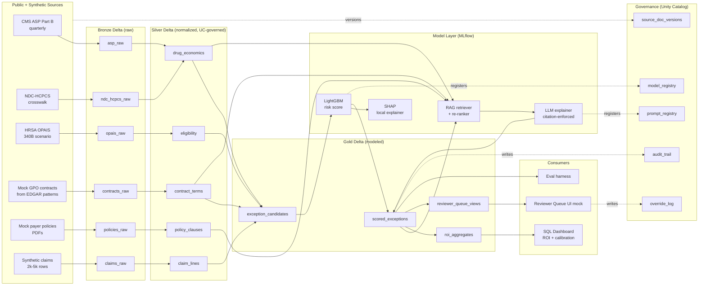

# Architecture — Revenue Integrity Control Tower

**Version:** 0.1
**Last updated:** 2026-04-24

---

## One-paragraph summary

A governed medallion pipeline on Databricks + Azure: public CMS ASP / NDC-HCPCS / HRSA OPAIS files plus mock GPO contract exhibits and synthetic oncology claims land in Bronze Delta; normalization and entity resolution produce Silver tables registered in Unity Catalog; Gold tables power the scored exception queue, ROI aggregates, and reviewer views. A LightGBM model (MLflow-tracked, registered, with SHAP explanations) scores exception risk. A RAG layer over policy and contract documents produces evidence-grounded explanations with citation enforcement and abstention. Every score and explanation is logged to a controllership audit table with model version, prompt version, source-document version, and reviewer override + rationale.

## System diagram

## Layer-by-layer

### Bronze — raw ingest
- **asp_raw**: CMS quarterly ASP Part B payment files (real, public)
- **ndc_hcpcs_raw**: CMS NDC-HCPCS crosswalk (real, public)
- **opais_raw**: HRSA OPAIS covered-entity + contract-pharmacy lists (real, public; used only in 340B scenario module)
- **contracts_raw**: mock GPO / specialty-distribution contract clauses extracted from SEC EDGAR exhibits (pattern-source public; content mock)
- **policies_raw**: mock payer-policy PDFs (synthetic; patterned on public Medicare LCDs and commercial payer policies)
- **claims_raw**: synthetic oncology claims, 2k–5k rows, top-10 J-codes (J9035 bevacizumab, J9299 nivolumab, J9312 rituximab, J9228 ipilimumab, J9145 daratumumab, J9173 durvalumab, J9271 pembrolizumab, J9317 trastuzumab-deruxtecan, J9144 daratumumab-hyaluronidase, J9042 brentuximab), 4 payer archetypes (Medicare, commercial-national, commercial-regional, Medicaid-managed)

### Silver — normalized, Unity-Catalog-registered
- **drug_economics**: J-code + NDC + ASP + ASP effective date + biosimilar-reference flag + 340B-ceiling-price flag
- **claim_lines**: claim_id, service_date, provider, NDC, J-code, units, billed, allowed, paid, CARC/RARC codes, payer, adjudication_status
- **contract_terms**: contract_id, counterparty, product_scope, tier_thresholds, rebate_pct, effective_dates, exclusions, stacking_rules
- **policy_clauses**: policy_id, payer, lob, effective_date, clause_text, clause_embedding, topic_tags
- **eligibility**: entity_id, eligibility_type, effective_dates, restrictions (340B scenario)

All Silver tables registered with Unity Catalog schema, owner, lineage, and tags. Row-level-security pattern documented (governance.md) using a synthetic protected attribute for PHI-adjacent design.

### Gold — modeled exception views
- **exception_candidates**: claim × rule-based trigger (e.g., billed > allowed threshold, J-code/NDC mismatch, ASP drift, tier-eligibility conflict)
- **scored_exceptions**: candidate + risk score + SHAP top features + dollars-at-risk + model version + scored_at
- **roi_aggregates**: daily + weekly rollups of dollars-at-risk, prevented leakage (from override-outcome back-fill), reviewer hours, payback
- **reviewer_queue_views**: ranked queue for the reviewer UI mock; filters on priority, exception type, dollar threshold

### Model layer
- **LightGBM** — tabular risk score on claim features + drug economics + contract + policy-exposure features; MLflow autologged; registered model `rev_integrity.risk_scorer@v1`
- **SHAP** — per-claim local explainer; top-3 features stored with each scored row
- **RAG retriever** — embedding model + cosine similarity over policy_clauses + contract_terms + asp timelines; re-ranker for citation candidates
- **LLM explainer** — prompt template enforces: (a) every factual claim has a citation, (b) citations come only from the retrieved set, (c) abstention when no retrieved passage exceeds similarity threshold; registered as `rev_integrity.explainer@v1` with prompt version

### Governance overlay
- **model_registry** (MLflow via Unity Catalog) — model version, training data version, metrics, owner, stage (staging / prod), model card link
- **prompt_registry** — prompt template version, diffs, eval results at promotion
- **source_doc_versions** — every ingested document hashed + versioned; scored exceptions reference source version
- **audit_trail** — every scored_exception row is append-only; updates produce new rows with supersedes_id
- **override_log** — reviewer_id, exception_id, original_score, reviewer_decision, rationale_category, rationale_text, decided_at

### Consumers
- **SQL Dashboard** — ROI summary, calibration plot, exception-type mix, reviewer throughput, payback waterfall
- **Reviewer Queue UI** — static mock (screenshots + narrative); production would be a Databricks App or embedded panel
- **Eval harness** — standalone submodule computing precision@k, $-captured/hour, calibration, citation precision, abstention rate, override distribution

## Deployment (aspirational; v0 is notebook-run)

- Databricks Asset Bundle defines: catalogs + schemas, Delta tables + expectations, MLflow experiments, registered models, jobs (batch scoring + batch eval), dashboards
- CI: GitHub Actions runs eval harness against the registered model on a synthetic holdout; blocks promotion if citation precision < 0.9 or calibration slope outside [0.9, 1.1]
- Serving (future): Databricks Model Serving for low-latency scoring; Vector Search for RAG retrieval at scale

## What is Databricks-compatible vs. Databricks-native

**Native (will run on Databricks):**
- Delta tables + Unity Catalog schema
- MLflow experiment + registered model
- Asset Bundle skeleton
- SQL dashboard definition

**Compatible but executed locally (Free Edition constraints):**
- Notebooks use PySpark / polars interchangeably so they also run on a laptop against local Parquet
- RAG layer uses in-memory vector store (FAISS) with a documented upgrade path to Databricks Vector Search
- LLM explainer can be swapped between Azure OpenAI and a local 70B model via config

## Non-goals (architectural)

- No streaming / real-time scoring in v1 (batch only)
- No multi-tenant RBAC beyond the documented Unity Catalog pattern
- No integration with any external EHR, RCM, or payer API
- No model that touches PHI at any point

## References

- CMS ASP Part B pricing files: public CMS Medicare payment system docs
- CMS NDC-HCPCS crosswalk: public CMS
- HRSA OPAIS: public HRSA 340B database
- Databricks medallion architecture: Databricks documentation
- MLflow model registry + Unity Catalog: Databricks documentation
