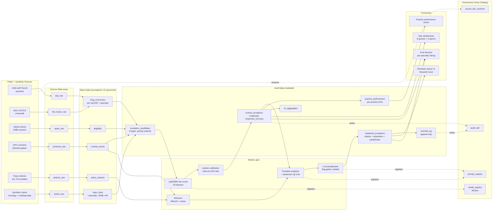

# Architecture — O&M Finance AI Control Tower

**Version:** 1.0 (Week 4)
**Last updated:** 2026-04-24

---

## One-paragraph summary

A governed medallion pipeline on Databricks + Azure spanning oncology + multispecialty care (retinal, rheumatology, gastroenterology, neurology). Public CMS ASP + NDC-HCPCS + HRSA OPAIS files plus mock GPO contract exhibits, a commercial prior-auth workflow corpus, and synthetic claims land in Bronze Delta; normalization and entity resolution produce Silver tables registered in Unity Catalog (claim lines carry specialty, 340B, and PA flags); Gold tables power the scored exception queue across ten exception types, ROI aggregates, per-practice performance views, and an append-only override log. A LightGBM model (MLflow-tracked, registered, with gain-based feature importance) scores exception risk; isotonic regression on a held-out fold produces a calibrated score. The reviewer queue ranks on `expected_recovery = risk_score_calibrated × dollars_at_risk`. A RAG layer over policy and contract documents produces evidence-grounded explanations with citation enforcement and abstention; an optional LLM paraphrase stage (feature-flagged) re-renders the top-k items via Ollama under a strict post-generation citation verifier. Every score, explanation, and reviewer decision is logged to a controllership audit table with model version, prompt version, source-document version, and override rationale.

## System diagram

## Layer-by-layer

### Bronze — raw ingest

- **asp_raw** — CMS ASP Part B (real, public); specialty tag per HCPCS (oncology + retinal + rheum + GI + neuro)
- **ndc_hcpcs_raw** — CMS crosswalk (real, public), extended to cover multispecialty NDCs
- **opais_raw** — HRSA OPAIS (real, public); used only in the 340B scenario module
- **contracts_raw** — mock GPO clauses patterned on SEC EDGAR exhibits (master rebate, biosimilar conversion, chargeback validation)
- **policies_raw** — mock payer policies: Medicare LCD, commercial national NCCN, commercial regional PA, Medicaid managed specialty, **commercial national PA workflow** (access-module grounding)
- **claims_raw** — 5k synthetic claims across 18 HCPCS × 4 payer archetypes × 20 practices × 5 specialties, with latent `is_true_error` state observed noisily by rules; drug prices anchored to real ASP

### Silver — normalized, Unity-Catalog-registered

- **drug_economics** — HCPCS + NDC + ASP/mg + biosimilar flag + specialty
- **claim_lines** — all claim facts plus: `practice_specialty`, `drug_specialty`, `is_340b_practice`, `is_340b_purchased`, `gpo_rebate_claimed`, `pa_required`, `pa_on_file`, `pa_gap`, `denial_reason_pa`, `access_delay_cost`, `billed_to_asp_ratio`, `paid_to_allowed_ratio`, `ndc_hcpcs_valid`
- **contract_terms / policy_clauses / eligibility** — as v0.1

Row-level-security pattern documented in `docs/governance.md` §4 (PHI overlay).

### Gold — modeled + governed

- **exception_candidates** — ten exception types in priority order:
  1. `access_pa_gap`
  2. `jw_drug_waste`
  3. `gpo_340b_rebate_excluded`
  4. `chargeback_validity_fail`
  5. `biosimilar_conversion_miss`
  6. `site_of_care_underpayment`
  7. `ndc_hcpcs_mismatch`
  8. `asp_drift`
  9. `underpayment`
  10. `denial`
- **scored_exceptions** — candidate + `risk_score` + `risk_score_calibrated` + `expected_recovery` + `expected_recovery_calibrated` + `model_run_id` + `model_name`
- **explained_exceptions** — scored rows + `citation_doc_id` + `citation_section` + `citation_score` + `retrieved_top_k` + `explanation_text` + `explained`/`abstained` + (optional) `paraphrase_text`, `paraphrase_status`
- **practice_performance** — per-practice exposure, exception mix, payer mix, access delay cost (feeds the executive memo)
- **override_log** — append-only reviewer decisions with model/prompt/source lineage
- **roi_aggregates** — daily/weekly rollups feeding the dashboard

### Model layer

- **LightGBM risk scorer** — 30 features (claim economics, drug attributes, practice attributes, access, rule indicators, payer one-hots, specialty one-hots, HCPCS ordinal); MLflow autologged; registered as `rev_integrity.risk_scorer@v1`
- **Isotonic calibration** — fit on a 20% held-out fold of the candidate universe; stored as `risk_score_calibrated`. V2 moves to k-fold cross-validated isotonic.
- **Retriever** — `sentence-transformers/all-MiniLM-L6-v2` embeddings + sklearn cosine similarity over chunked policies + contracts. Swap for Databricks Vector Search at scale (same interface).
- **Template explainer** — query templates keyed on `exception_type`; emits `explanation_text` only when `citation_score ≥ 0.64`, else abstains with a structured reason. Deterministic and reproducible.
- **LLM paraphraser (stage 7b, flag-gated)** — Ollama wrapper; post-generation verifier requires `[doc §section]` marker AND a 40-char verbatim fragment of the retrieved clause. Verification failure OR unreachable endpoint → falls back to template. Never publishes an unverified paraphrase.

### Governance overlay

See `docs/governance.md` for the full reference architecture. Summary:

- **model_registry** — MLflow (Unity Catalog-backed in prod)
- **prompt_registry** — template + LLM prompt versions with eval pointers
- **source_doc_versions** — SHA of every policy / contract chunk at retrieval time
- **audit_trail** — append-only scored-row log with supersedes_id
- **override_log** — append-only reviewer actions

### Consumers

- **SQL dashboards** — 8 queries (leakage summary, reviewer queue top-100, exception exposure, practice heatmap, calibration health, override distribution, **specialty mix, access/PA performance**) under `dashboards/sql/`, plus 6 drift alarms under `dashboards/sql/alerts/` and the Unity Catalog RLS DDL under `dashboards/sql/governance/`
- **Reviewer queue UI** — Streamlit mock at `src/oaifinance/ui/app.py` (run with `make reviewer-ui`); production UI is a Databricks App or embedded workstation panel
- **Practice performance memo** — executive artifact driven by `oaifinance.practice.performance`
- **Eval harness** — computes three rankings, citation precision, abstention rate, calibration, per-specialty slicing

## What is Databricks-native vs. Databricks-compatible

**Native:** Delta tables, Unity Catalog schemas, MLflow experiment + registered model, Databricks Asset Bundle skeleton, SQL dashboard definitions.

**Compatible (runs locally on Parquet; zero code change to deploy):** all notebooks use PySpark/polars interchangeably; retrieval uses an in-memory FAISS-equivalent with documented upgrade path to Databricks Vector Search; LLM layer is config-swappable between Ollama (local dev), Azure OpenAI, and Databricks Mosaic AI Model Serving.

## Non-goals (architectural)

- No streaming / real-time scoring in V1 (batch only)
- No integration with external EHR, RCM, or payer APIs
- No model that touches PHI at any point
- No automated payer-outbound action (appeal submission, PA submission, chargeback filing) — always human-approved

## References

- CMS ASP Part B pricing files (public)
- CMS NDC-HCPCS crosswalk (public)
- HRSA OPAIS 340B database (public)
- Databricks medallion, Unity Catalog, MLflow Registry, Mosaic AI docs
- `docs/governance.md` for full governance design
- `docs/model-card.md` for model-level governance detail
